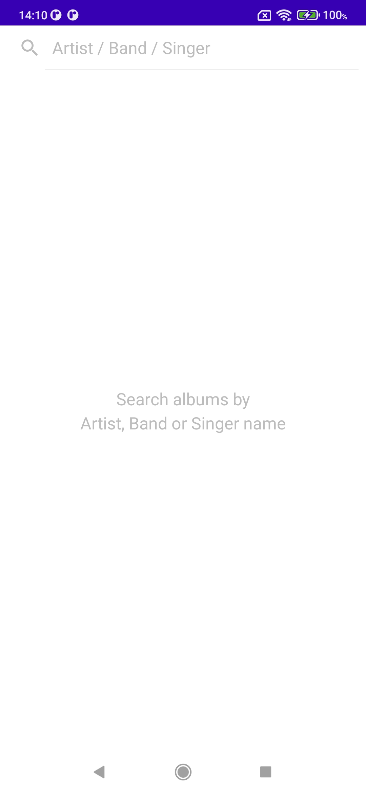
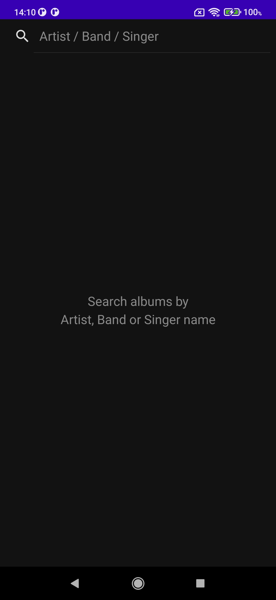
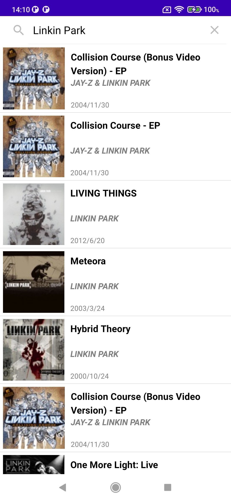
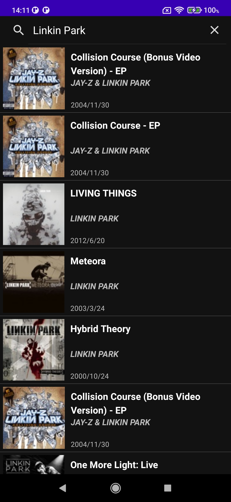
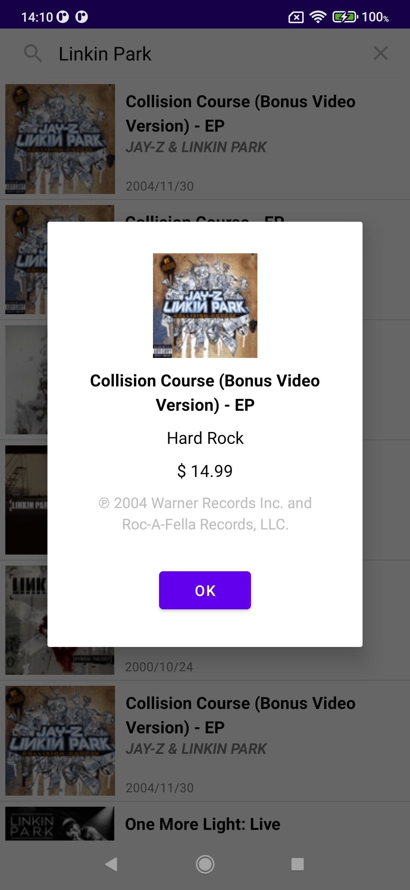

## Specs
- Android Studio Dolphin | 2021.3.1 Patch 1
- Build #AI-213.7172.25.2113.9123335, built on September 29, 2022
- Runtime version: 11.0.13+0-b1751.21-8125866 x86_64

- Architecture: MVVM + Koin + Flow
- Third Party Libs: Glide, Retrofit

## Screenshots
light|dark
:--:|:--:
|
|
|